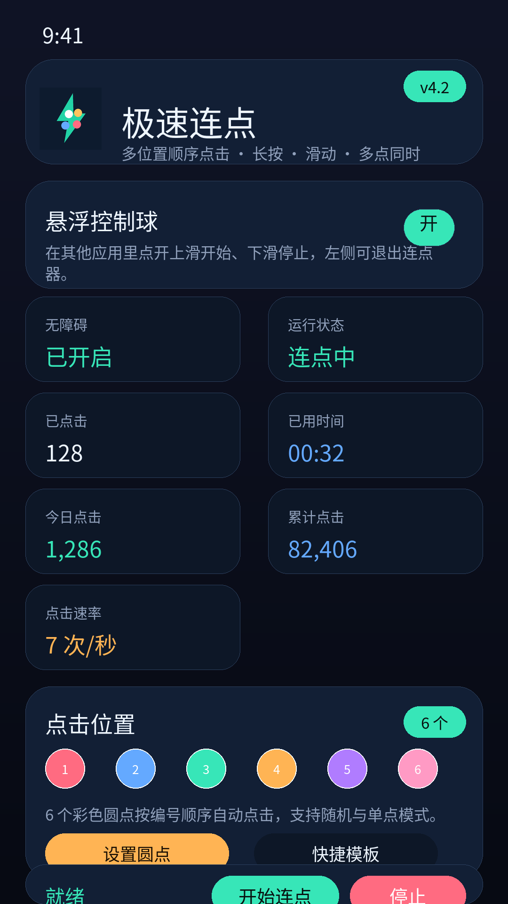
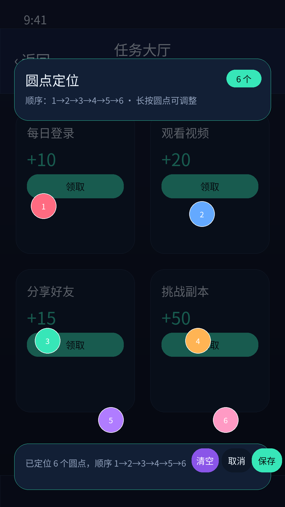
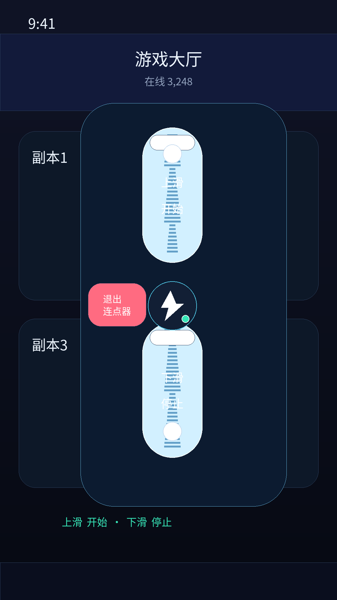
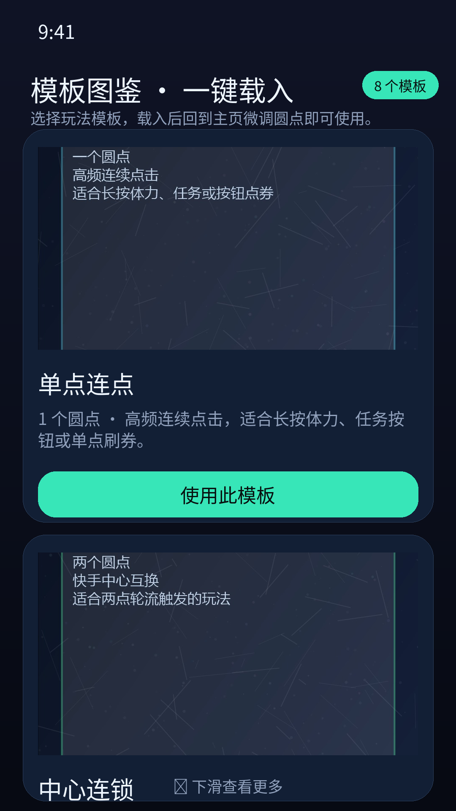
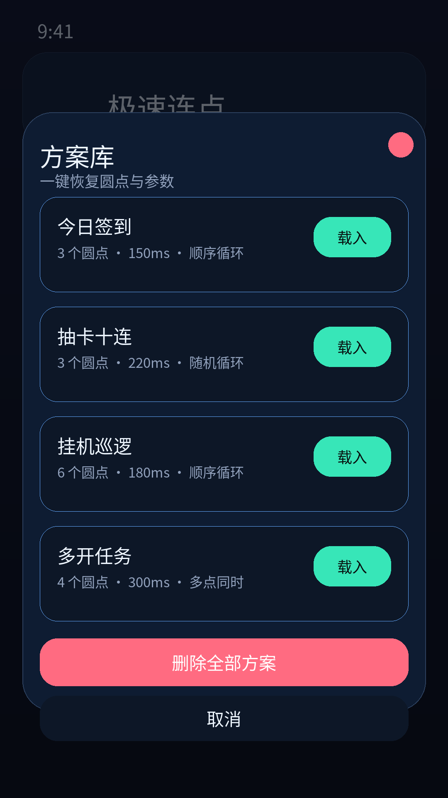
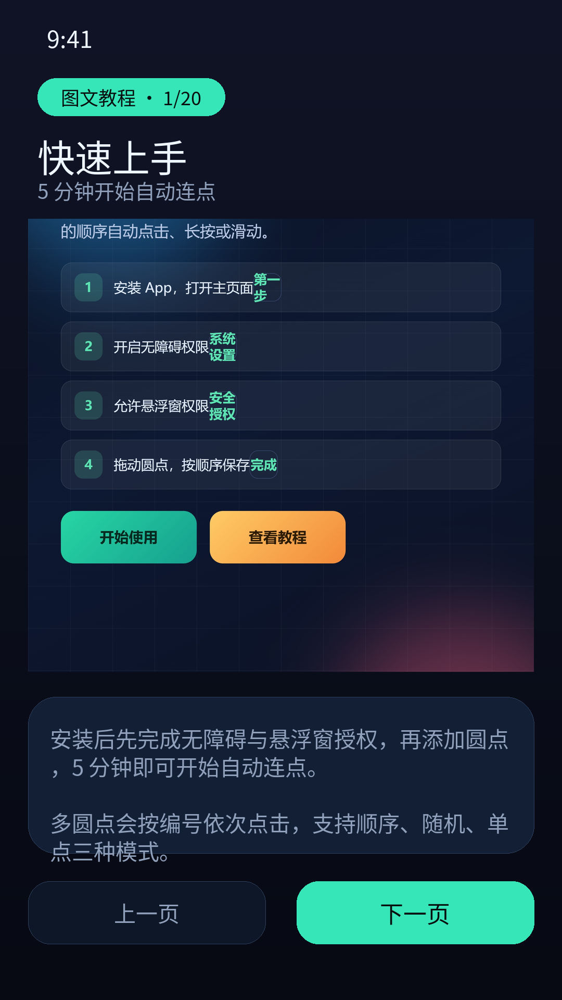

# 极速连点器（Jisu Lian Dian Qi / Auto Tapper）

一款 20MB 级的安卓自动连点器。不需要手动输入屏幕 x/y 坐标，直接拖拽悬浮圆点即可完成多点定位，适合个人重复操作场景。

## 最新版本

- 版本号：4.2
- versionCode：7
- 更新日期：2026-08-15
- 包名：com.example.autotapper
- 最低系统：Android 7.0（API 24）
- 目标系统：Android 14（API 34）
- 是否联网：否

下载：[极速连点器_v4.2.apk](dist/极速连点器_v4.2.apk)（约 20.66 MB），也可在 [GitHub Releases](https://github.com/junfeng-lv/jisu-lian-dian-qi/releases/latest) 页面下载。

## v4.2 功能

- 多圆点悬浮定位：点「＋」添加，拖动圆点对齐目标，长按圆点可前移、后移、删除。
- 像素级微调：长按圆点打开微调面板，方向键 10px，长按方向键 1px。
- 三种点击模式：顺序点击、随机点击、单点模式。
- 四种手势：普通点击、长按、滑动、多点同时。
- 快捷模板与模板图鉴：8 套内置玩法，一键载入后回主页微调。
- 方案库：保存圆点、间隔、次数、模式与手势，多玩法一键切换。
- 悬浮控制球：上滑开始、下滑停止、左侧退出，其他应用内可直接控制。
- 统计中心：本次点击、今日点击、累计点击、点击速率。
- 通知栏状态与快捷停止，20 页高清图文离线教程。

## 截图








## 使用方法

1. 下载并安装 APK。
2. 打开应用，先开启无障碍服务并允许悬浮窗。
3. 点「设置圆点」进入定位，添加并拖动圆点，保存即可。
4. 设置间隔、次数与手势，点「开始连点」。

## 权限说明

- 无障碍服务：模拟屏幕点击、长按和滑动手势。
- 悬浮窗：用于拖拽圆点定位和显示悬浮控制球。
- 通知：展示连点运行状态并提供一键停止。
- 前台服务：保持悬浮控制球稳定运行。

隐私政策见 [docs/隐私政策.md](docs/隐私政策.md)。

## 重新打包

需要 Android SDK（build-tools 36）与 JDK 21：

```powershell
powershell -ExecutionPolicy Bypass -File build-apk.ps1
```

输出 `auto_tapper.apk`。签名密钥请自行妥善保管，`.android_keystore.jks` 不会提交到仓库。

## 请我喝杯奶茶炸鸡

如果这个工具帮到了你，欢迎扫码支持一下，感谢每一杯奶茶和每一份炸鸡！

